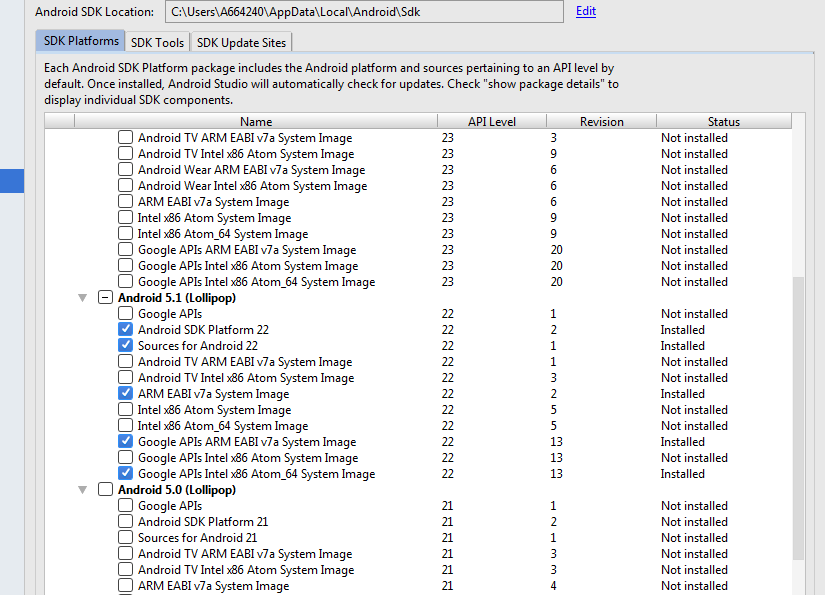
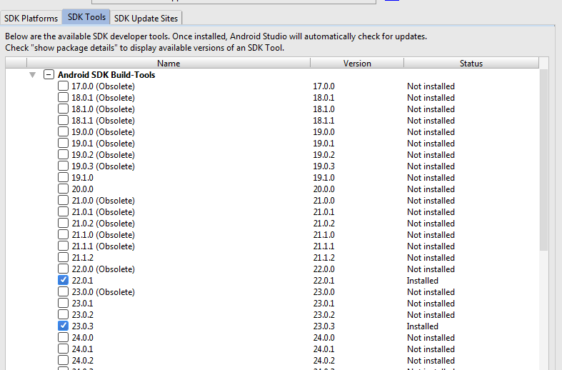

# À propos de l'application ENT-MOBILE

* Licence : [AGPL v3](http://www.gnu.org/licenses/agpl.txt) - Copyright Conseil Régional Nord Pas de Calais - Picardie

* Développeur(s) : ATOS

* Financeur(s) : Région Nord Pas de Calais-Picardie

* Description : Application mobile multi-plateforme pour l'OPEN ENT NG

# Documentation technique


PREREQUIS: Installer <b>Node.js 4</b> 
           puis <b>cordova </b>
           et <b>ionic</b> : ```npm install -g cordova ionic```

On va ensuite récupérer les plugins ainsi que les platformes nécéssaires au bon fonctionnement
de l'application: cordova prepare

Pour lancer l'application, ```ionic run android``` ou ```ionic run ios``` selon le mobile branché.

Pour plus d'informations, consulter https://github.com/driftyco/ionic-cli.

**Installation**

code : [https://github.com/OPEN-ENT-NG/ent-mobile](https://github.com/OPEN-ENT-NG/ent-mobile)

## Developments tools
 - java sdk 1.7
 - node js : 6.10.0
 - cordova : 5.1.1
 - ionic : 2.2.1
 - gulp : 3.9.1
 - bower : 1.8.0
 - android studio : 2.3
 - maven : 3.3.9
 - gradle : 1.6


## Installation

- installer le java sdk 1.7 & vairable JAVA_HOME & binaire java dans le path
- installer node 6.10.0
- installer maven 3.3.9 & ajouter le binaire maven dans le path
- installer gradle & ajouter le binaire gradle dans le path
- installer android studios 2.3
- lancer le telchargement du sdk




Ecraser le répertoire "tools" du SDK avec la version 25.2.3 (tools_r25.2.3-windows.zip).

- ajouter la variable environnement ANDROID_HOME = C:\Users\A664240\AppData\Local\Android\sdk
- ajouter dans le path platform-tools et tools du sdk :
```
C:\Users\A664240\AppData\Local\Android\sdk\platform-tools;C:\Users\A664240\AppData\Local\Android\sdk\tools
```

- installer les composants npm dans une console administrateur:
```
npm install -g cordova@5.1.1
npm install -g ionic@2.2.1
npm install -g gulp@3.9.1
npm install -g bower@1.8.0
```

- Dans le répertoire du projet :
```
npm install
```

- prepare
```
cordova prepare
```
Si vous avez l'erreur suivante :
```
npm http GET https://registry.npmjs.org/cordova-android
TypeError: Request path contains unescaped characters
```
cela vient probablement du proxy. Il faut donc se mettre en connexion sans proxy, et retirer les paramètres proxy du npm.
Pour ce faire, regardez les proxys que vous aviez parametrés afin de pouvoir les récupérer :
```
npm config list
```
Et supprimez les
```
npm config rm proxy
npm config rm https-proxy
```
puis relancer ```cordova prepare```.

pour vous assurer que l'ensemble des elements sont correctement installés :
 ```
 cordova requirements
 ```

- pour android : modifier les targets lib, editer le fichier : ```ent-mobile\platforms\android\project.properties``` et changer les instruction suivantes
<pre>
cordova.system.library.1=com.android.support:support-v4:<strong>23.+</strong>
cordova.system.library.2=com.android.support:appcompat-v7:<strong>23.+</strong>
cordova.system.library.3=com.android.support:support-v4:<strong>23.+</strong>
</pre>
- creer une apk :
```
ionic build
```

## développement :
- Modifier le code dans le répertoire /www du projet ent-mobile.
-  dans une console, aller dans le répertoire racine du projet ent-mobile
-  connecter son téléphone en mode debug par USB.
-  lancer ```ionic run android``` : cela va pousser l'apk sur le téléphone.

Debug via Chrome :
- Aller dans chrome, et faire F12.
- Dans le menu en haut à droite, sélectionner "More Tools" et "Remote devices". Cela ouvre une fenêtre en bas normalement.
- Si le téléphone est reconnu, on clique dessus, et en appuyant sur "Inspect", on synchronise la vue du téléphone et celle de chrome.


## Errors

[Erreur Android target](https://forum.ionicframework.com/t/support-library-doesnt-match-android-target-version/84118)
